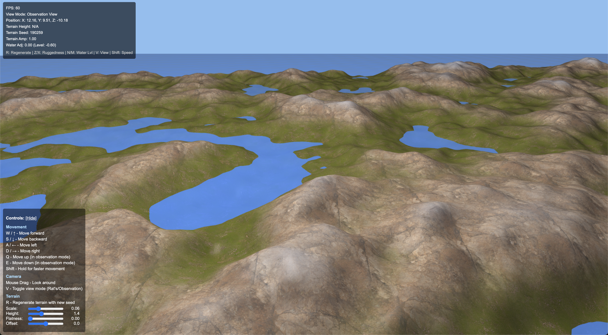

# WebGL Terrain Generator



## 🏔️ Overview

An advanced, interactive 3D terrain generator built with WebGL 2.0 that creates stunning, procedurally generated landscapes with realistic features. This project demonstrates modern graphics programming techniques and real-time terrain rendering.

## ✨ Features

- **Procedural Terrain Generation**: Uses Simplex noise to create natural-looking, varied landscapes
- **Dynamic Terrain Controls**: Adjust terrain parameters in real-time:
  - Scale: Control the size of terrain features
  - Height: Modify the overall elevation
  - Flatness: Adjust how mountainous or flat the terrain appears
  - Offset: Shift the entire terrain vertically
- **Infinite Terrain**: Dynamically loads terrain chunks as you explore
- **Multi-threaded Processing**: Uses Web Workers for terrain generation to maintain smooth performance
- **Realistic Water**: Transparent, animated water with reflections and wave effects
- **Texture Blending**: Seamless blending between grass, rock, and snow textures based on elevation and slope
- **Two Camera Modes**:
  - Rat's View: First-person perspective with automatic height adjustment
  - Observation View: Free-flying camera for a bird's-eye view
- **Performance Optimizations**:
  - Frustum culling to only render visible terrain
  - Chunk-based rendering for efficient memory usage
  - Anisotropic texture filtering for better visual quality
- **Responsive Design**: Automatically adjusts to window size changes

## 🎮 Controls

### Movement
- **W / ↑**: Move forward
- **S / ↓**: Move backward
- **A / ←**: Move left
- **D / →**: Move right
- **Q**: Move up (in observation mode)
- **E**: Move down (in observation mode)
- **Shift**: Hold for faster movement

### Camera
- **Mouse Drag**: Look around
- **V**: Toggle view mode (Rat's/Observation)

### Terrain
- **R**: Regenerate terrain with a new random seed
- **Sliders**: Adjust terrain parameters in real-time

## 🔧 Technical Implementation

### WebGL 2.0
The project leverages WebGL 2.0 features for high-performance 3D rendering, including:
- Vertex and fragment shaders for realistic lighting and effects
- Efficient buffer management for terrain chunks
- Texture mapping with anisotropic filtering

### Procedural Generation
- **Simplex Noise**: Creates natural-looking terrain with multiple octaves
- **Fractal Brownian Motion**: Combines multiple noise layers for detailed terrain
- **Seeded Random Generation**: Allows reproducible terrain with the same seed

### Multi-threading
- **Web Workers**: Offloads terrain generation to background threads
- **Transferable Objects**: Efficiently transfers large data between threads without copying

### Optimizations
- **Frustum Culling**: Only renders terrain chunks visible to the camera
- **Dynamic LOD**: (Planned feature) Adjusts detail level based on distance
- **Chunk Management**: Loads and unloads terrain chunks based on camera position

## 🚀 Getting Started

### Prerequisites
- A modern web browser with WebGL 2.0 support (Chrome, Firefox, Edge, Safari)

### Running Locally
1. Clone the repository:
   ```bash
   git clone https://github.com/kolin-nielson/Webgl-Terrain.git
   ```

2. Navigate to the project directory:
   ```bash
   cd Webgl-Terrain
   ```

3. Start a local server:
   ```bash
   # Using Python 3
   python -m http.server 8000
   
   # Using Node.js
   npx serve
   ```

4. Open your browser and navigate to:
   ```
   http://localhost:8000
   ```

## 🔮 Future Enhancements

- Dynamic time of day with changing lighting
- Weather effects (rain, snow, fog)
- Vegetation and trees
- Level of Detail (LOD) system for distant terrain
- Collision detection for more realistic movement
- Customizable biomes (desert, tundra, forest)
- Saving and sharing terrain configurations

## 🛠️ Built With

- **WebGL 2.0** - Modern 3D graphics API
- **JavaScript (ES6+)** - Core programming language
- **gl-matrix** - Matrix/vector math operations
- **simplex-noise** - Procedural noise generation

## 🙏 Acknowledgments

- Inspired by various terrain generation techniques in modern game engines
- Thanks to the WebGL and graphics programming community for resources and examples

---

Created by [Kolin Nielson](https://github.com/kolin-nielson)
